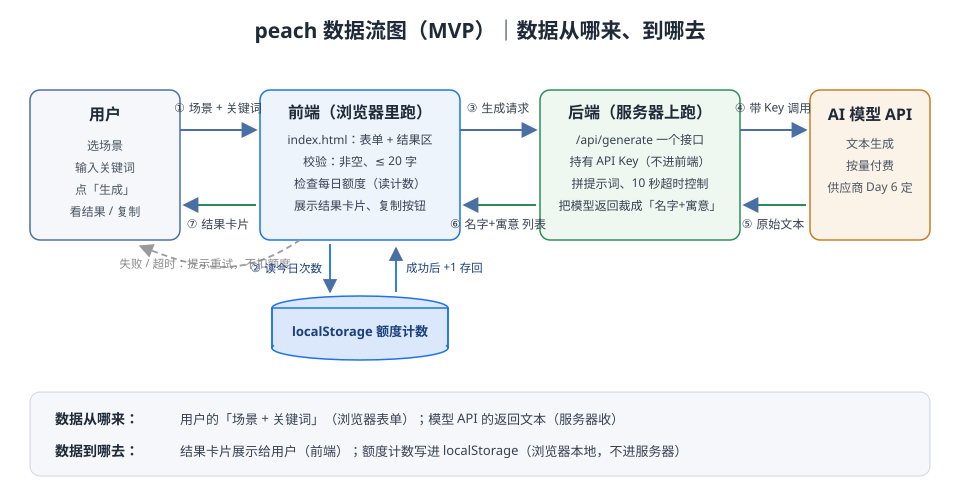

# TECH_DESIGN｜peach 技术设计——一句话说清数据从哪来、到哪去

- 版本：v1.0（Day 5，基于 Day 4 PRD.md v2.0 做技术选型）
- 状态：已定技术路线（进入 Day 6–7 开发）
- 上游文档：`PRD.md`（Day 4 功能需求与验收标准）、`research.md`（Day 3 方向）
- 今日纪律：不写代码；不顺手改 PRD（发现 PRD 问题只记录在文末）

---

## 1. 一句话技术路线

> **静态单页前端 + 一个轻后端接口（Node.js）+ 不用数据库（额度计数存浏览器 localStorage）+ 文本生成模型 API。**

## 2. 前后端与数据库分工

| 角色 | 在哪跑 | 负责什么 | 明确不负责什么 |
| --- | --- | --- | --- |
| **前端** | 用户浏览器 | 唯一页面（`index.html`）；表单校验（关键词非空、≤ 20 字，对应 A5/A6）；每日额度检查（读 localStorage）；展示结果卡片与复制按钮（A4） | 不存 API Key、不直接调模型 API、不判断内容质量 |
| **后端** | 服务器 | 只有 1 个接口 `/api/generate`：接收「场景+关键词」→ 拼提示词 → 调模型 API → 控 10 秒超时 → 把返回裁成「名字+寓意」列表给前端 | 不做用户体系、不做防刷（PRD 明确 MVP 不追求）、不存历史记录 |
| **数据库** | —— | **本期没有数据库。** 每日额度用浏览器 localStorage 按天计数（如 key `peach_quota_2026-09-23`） | 不存名字历史（PRD 已砍掉）、不做多设备同步 |

**为什么数据库可以是「没有」**：PRD 3.3 明确「MVP 不追求防刷，只求明确告知限额」，且历史记录已被砍掉——额度计数是唯一需要「记住」的状态，而它只对当前浏览器有意义，localStorage 就是最轻的满足方式。等出现防刷或历史记录需求，再引入数据库（见第 5 节影响面表）。

## 3. 技术路线与理由（示范路线，逐项写明为什么暂时选它）

| 选型项 | 选什么 | 为什么暂时选它 |
| --- | --- | --- |
| 前端 | 原生 HTML/CSS/JS，单页 | 只有 1 个页面，Day 2 已有 `index.html` 骨架；不上框架可少一套构建工具，Day 7 交付前少一个出错环节 |
| 后端 | Node.js 单文件接口（或部署平台的 Serverless Function） | **必须有一层后端**：① 模型 API Key 不能暴露在前端；② 10 秒超时（A3/A8）要在服务端控制；③ 裁剪模型返回的脏活放在服务端，前端保持简单。选 Node.js 是因为与前端同一种语言，学习面最小 |
| AI 能力 | 文本生成模型 API（倾向 DeepSeek / 智谱这类国内直连、按量付费便宜的供应商） | PRD 假设「依赖一个文本生成模型 API」；具体供应商留到 Day 6 接入时实测后定，技术上只依赖「输入提示词、返回文本」这一标准形态，换供应商成本很低 |
| 额度计数 | localStorage 按天存 key | 理由见第 2 节；PRD 3.3 边界情况「失败不消耗额度」只需在前端写回时跳过失败分支即可 |
| 部署 | 支持「静态站 + Serverless 函数」的一体化平台 | 前端是静态文件、后端只有 1 个函数，这类平台免费额度足够 MVP，且自带 HTTPS 公网链接（A9 需要手机可访问） |

**什么时候会重新评估**（写下来防止路线漂移）：
- 出现防刷 / 历史记录 / 收藏需求 → 引入数据库，额度计数迁到后端；
- 页面超过 1 个或状态变复杂 → 前端上框架（如 Vue/React）；
- 模型供应商不稳定或太贵 → 只换第 3 节 AI 一行，其他不动。

## 4. 数据流图（数据从哪来、到哪去）

文字版一句话：**用户的「场景+关键词」从浏览器表单出发 →（通过额度检查后）发给后端接口 → 后端带着 API Key 调模型 API → 模型返回的文本经后端裁成「名字+寓意」列表 → 回到前端渲染成结果卡片；同时成功次数 +1 写进 localStorage。失败/超时的请求不扣额度。**

| 编号 | 数据 | 从哪来 | 到哪去 |
| --- | --- | --- | --- |
| ① | 场景 + 关键词 | 用户输入 | 前端表单（先本地校验） |
| ② | 今日已用次数 | localStorage（浏览器本地） | 前端额度检查 |
| ③ | 生成请求 | 前端 | 后端 `/api/generate` |
| ④ | 请求 + API Key | 后端 | AI 模型 API |
| ⑤ | 模型原始返回文本 | AI 模型 API | 后端（裁剪、控超时） |
| ⑥ | 「名字+寓意」结构化列表 | 后端 | 前端 |
| ⑦ | 结果卡片 + 额度 +1 | 前端 | 用户看到结果；计数写回 localStorage |

## 5. 加练①｜方案变化时哪些文件会受影响

| 变化 | 会受影响的文件 | 大致代价 |
| --- | --- | --- |
| 换 AI 模型供应商 | 后端接口文件（只改「调模型」一段）、`.env`（Key 与接口地址） | 小——这就是把模型调用收在后端一层的回报 |
| 引入数据库（防刷/历史记录） | 后端接口文件、新增数据库连接与建表脚本、前端计数逻辑改为读后端 | 中 |
| 前端上框架 | `index.html` 拆成组件目录、新增构建配置（如 `package.json`、`vite.config`） | 中 |
| 换后端语言/框架 | 后端目录全部 + 部署配置 | 大，尽量避免 |
| 换部署平台 | 部署配置、环境变量说明 | 小–中 |
| 改每日免费次数（5→N） | 前端额度检查常量、页面文案 | 很小 |

## 6. 加练②｜技术栈 30 秒版（给自己扫盲）

| 技术 | 是什么 | 优势 | 劣势 |
| --- | --- | --- | --- |
| HTML/CSS/JS | 浏览器原生三件套，网页的骨架/皮肤/行为 | 无构建、无依赖，一个文件就能跑 | 页面一多、状态一复杂就难维护 |
| 前端框架（Vue/React） | 帮你管理页面状态和组件复用的库 | 复杂界面好维护、生态大 | 要学、要构建工具，小页面是杀鸡用牛刀 |
| Node.js | 让 JS 跑在服务器上的运行时 | 与前端同语言，写 API 快 | CPU 密集任务不是强项 |
| Python（Flask/FastAPI） | 另一种常见后端选择 | AI 生态最顺 | 与前端不同语言，多学一套 |
| 数据库（SQLite/MySQL 等） | 服务器上持久存数据的地方 | 数据可靠、可查、多端共享 | 要设计表、要运维；本期的轻量需求用不上 |
| localStorage | 浏览器提供的本地键值存储 | 零成本、即存即用 | 只在当前浏览器有效，清缓存就没了（本期场景可接受） |
| Serverless Function | 平台托管的「按次执行」的小后端 | 免运维、免费额度够 MVP | 冷启动可能慢、平台绑定 |

---

## 附：今日记录但不动手的 PRD 备注

- 暂无需要修改 PRD 的问题。（若 Day 6 接入模型时发现 10 秒时效不现实，再回来改 A3/A8。）
